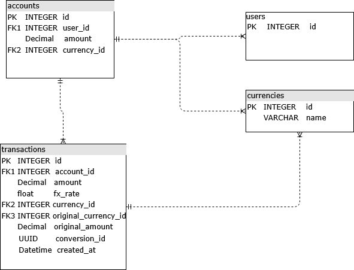

# Payment FX Processor

This repo contains transactions processing functionality.


## Table of Contents
- [Assumptions](#assumptions)
- [Requirements](#requirements)
- [Usage](#usage)
- [Docs](#docs)
- [Tests](#tests)
- [Entities](#entities)
- [Transactions](#transactions)
- [Reconciliations](#reconciliations)
- [Rates](#rates)

## Assumptions

- Wallets will be created upon funding.
- Wallets will be unique by user_id and currency.
- MXN and USD currencies are only supported.

## Requirements

Python >= 3.11

## Usage

```sh
uvicorn src.main:app --reload
```

## Docs

You can view API endpoints and schemas on http://localhost:8000/docs

## Tests

Make sure everything is running as expected by running our tests

```sh
coverage run -m pytest
```

Report coverage using

```sh
coverage report
```


## Entities

We consider users as our customers, who can own multiple wallets. These wallets store updated balance considering every transaction, thus a wallet will have many transactions associated. Both wallets and transaction will have a currency associated.




## Transactions

For transactions we will be duplicating `currency_id` because this will help us in the future for reconciliation purposes, this will make the history consistent and will make our queries faster accessing transactions by their currency.

Also we will be adding `fx_rate`, and `original_amount` and `original_currency_id` to for audit and exporting purposes.


## Reconciliations

For reconciliations we can compare account balance and their sum of their transactions by comparing `created_at` + `conversion_id` for grouping similar conversion transactions and check balance == debit + credit + conversion tx

```
{
    "MXN": 50,
    "USD": 5
}
```

```
[
    {
        "id": 1,
        "account_id": 1,
        "currency_id": 1,
        "amount": 100,
        "type": "credit",
        "original_currency_id": 1,
        "original_amount": 100,
        "fx_rate": null,
        "conversion_id": null,
        "created_at": "2025-07-15T01:25:30.814660"
    },
    {
        "id": 2,
        "account_id": 1,
        "currency_id": 1,
        "amount": 100,
        "type": "debit",
        "original_currency_id": 1,
        "original_amount": 100,
        "fx_rate": 0.053,
        "conversion_id": "0fc9b75d-f1c9-488d-9076-4b9912e746ef",
        "created_at": "2025-07-15T01:25:30.814660"
    },
    {
        "id": 3,
        "account_id": 1,
        "currency_id": 2,
        "amount": 5,
        "type": "credit",
        "original_currency_id": 1,
        "original_amount": 100,
        "fx_rate": 0.053,
        "conversion_id": "0fc9b75d-f1c9-488d-9076-4b9912e746ef",
        "created_at": "2025-07-15T01:25:30.814660"
    },
    {
        "id": 4,
        "account_id": 1,
        "currency_id": 1,
        "amount": 100,
        "type": "credit",
        "original_currency_id": 1,
        "original_amount": 100,
        "fx_rate": null,
        "conversion_id": null,
        "created_at": "2025-07-15T01:25:30.814660"
    },
    {
        "id": 5,
        "account_id": 1,
        "currency_id": 1,
        "amount": 50,
        "type": "debit",
        "original_currency_id": 1,
        "original_amount": 50,
        "fx_rate": null,
        "conversion_id": null,
        "created_at": "2025-07-15T01:25:30.814660"
    }
]
```

## Rates

We will simulate rates fluctuation by using an async task generator provided by fastapi utils.

- Retrieve_fx_rates run every minute and updates MXN and USD rates


# Extra

Included mamba as prototype to run tests

```sh
mamba tests
```
